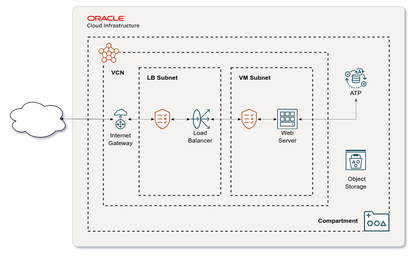

# Oracle Cloud Resource Manager Stack for APEX Blog

Terraform configuration to deploy APEX Blog application on Oracle Cloud Infrastructure (OCI) utilizing always free resources.

## Install

Click below link to open Oracle Cloud console and import stack.

[![Deploy to Oracle Cloud][orm_button]][stack_import_url]

After apply job is completed, view Application information tab to see e.g. generated passwords. Please note that web server configuration and application installation to database will take few minutes after apply job is completed.

[orm_button]: https://oci-resourcemanager-plugin.plugins.oci.oraclecloud.com/latest/deploy-to-oracle-cloud.svg
[stack_import_url]: https://cloud.oracle.com/resourcemanager/stacks/create?zipUrl=https://github.com/jariolaine/apex-blog/releases/latest/download/apex-blog-stack-latest.zip